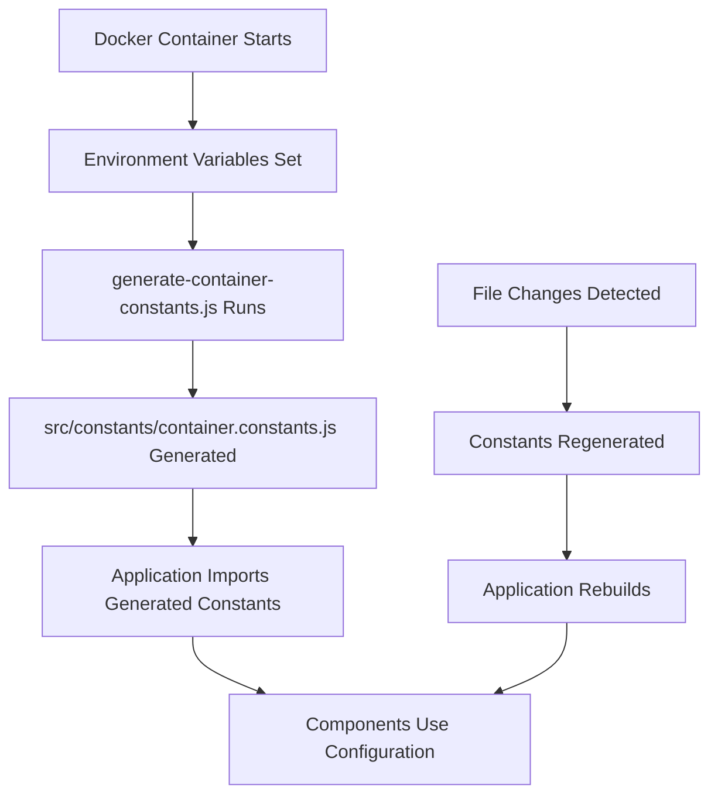

# Environment Configuration System

This document provides comprehensive documentation for the environment-based configuration system that replaces the legacy hostname-based configuration.

## Table of Contents
- [Overview](#overview)
- [How It Works](#how-it-works)
- [Environment Variables](#environment-variables)
- [Configuration Files](#configuration-files)
- [Usage Examples](#usage-examples)
- [Migration Guide](#migration-guide)
- [Code Integration](#code-integration)
- [Debugging](#debugging)
- [Benefits](#benefits)
- [Troubleshooting](#troubleshooting)

## Overview

The environment configuration system allows you to control application behavior through environment variables instead of relying on `window.location.hostname`. This provides:

- **Flexibility**: Configure any environment without code changes
- **Portability**: Same image works across environments
- **Testability**: Easy to test with different configurations
- **Security**: Sensitive configuration through environment variables
- **Maintainability**: Centralized configuration management

## How It Works



### Execution Flow

1. **Container Startup**: Environment variables are read from Docker/Kubernetes
2. **Constants Generation**: `scripts/generate-container-constants.js` creates configuration file
3. **Application Integration**: React components import from generated constants
4. **Runtime Updates**: File watcher regenerates constants on changes (development only)
5. **Fallback Support**: Falls back to hostname-based logic if constants unavailable

## Environment Variables

### Site Configuration

| Variable | Type | Default | Description | Example |
|----------|------|---------|-------------|---------|
| `SITE_TITLE` | string | `Development Catalogus` | Main site title | `Software Catalogus` |
| `SITE_DESCRIPTION` | string | `Local development instance...` | Meta description | `Official software catalog` |
| `SITE` | string | `localhost` | Site identifier | `production` |
| `MODE` | string | `development` | Application mode | `production` |
| `THEME_VARIANT` | string | `development` | Main CSS theme class | `dimpact`, `vng`, `tilburg`, `rotterdam`, `migrato`, `opencatalogi` |
| `ENVIRONMENT_NAME` | string | `development` | Environment name | `staging`, `production` |

### API Configuration

| Variable | Type | Default | Description | Example |
|----------|------|---------|-------------|---------|
| `API_URL` | string | `https://vng.test.commonground.nu/apps` | Primary API endpoint | `https://api.example.com/apps` |
| `API_URL_COMMONGROUND` | string | `https://vng.test.commonground.nu/apps` | CommonGround API | `https://cg.example.com/apps` |
| `API_URL_COMMONGROUND_TOKEN` | string | `` | API authentication token | `Bearer eyJ0eXAiOiJKV1...` |
| `API_URL_COMMONGROUND_ORGANIZATION_OIN` | string | `` | Organization identifier | `00000001234567890000` |
| `GEMMA_ENDPOINT` | string | `https://vng.test.commonground.nu` | GEMMA service URL | `https://gemma.example.com` |
| `OPENCONNECTOR_API_URL` | string | `https://vng.test.commonground.nu/apps/openconnector/api` | OpenConnector API base URL | `https://oc.example.com/api` |

### Authentication Configuration

| Variable | Type | Default | Description | Example |
|----------|------|---------|-------------|---------|
| `GRANT_TYPE` | string | `authorization_code` | OAuth2 grant type | `client_credentials` |
| `CLIENT_ID` | string | `` | OAuth2 client ID | `my-app-client-id` |
| `CLIENT_SECRET` | string | `` | OAuth2 client secret | `super-secret-key` |
| `PROVIDER` | string | `nextcloud` | Auth provider | `keycloak`, `auth0` |
| `REGISTER_URL` | string | `` | User registration URL | `https://auth.example.com/register` |

### Session Configuration

| Variable | Type | Default | Description | Example |
|----------|------|---------|-------------|---------|
| `AUTO_LOGOUT` | boolean | `false` | Enable automatic logout | `true` |
| `AUTO_LOGOUT_TIME` | number | `3600` | Auto-logout time (seconds) | `7200` |

### Monitoring Configuration

| Variable | Type | Default | Description | Example |
|----------|------|---------|-------------|---------|
| `ROLLBAR_KEY` | string | `` | Rollbar access token | `a1b2c3d4e5f6...` |
| `ROLLBAR_ENVIRONMENT` | string | `development` | Rollbar environment | `production` |

### Feature Flags

| Variable | Type | Default | Description | Example |
|----------|------|---------|-------------|---------|
| `ENABLE_AUTHENTICATION` | boolean | `false` | Show login features | `true` |
| `ENABLE_GEMMA` | boolean | `true` | Enable GEMMA integration | `false` |
| `ENABLE_DIRECTORY` | boolean | `true` | Enable directory functionality | `false` |
| `ENABLE_ROLLBAR` | boolean | `false` | Enable error monitoring | `true` |
| `ENABLE_MOCK_THEMES` | boolean | `false` | Use mock themes when API unavailable | `true` |

### External URLs

| Variable | Type | Default | Description | Example |
|----------|------|---------|-------------|---------|
| `EXTERNAL_WEBSITE_URL` | string | `https://www.tilburg.nl/` | Main website | `https://www.example.com/` |
| `EXTERNAL_PRIVACY_URL` | string | `https://www.tilburg.nl/privacystatement/` | Privacy policy | `https://example.com/privacy` |
| `EXTERNAL_COOKIES_URL` | string | `https://www.tilburg.nl/cookies/` | Cookie policy | `https://example.com/cookies` |
| `EXTERNAL_PROCLAIMER_URL` | string | `https://www.tilburg.nl/proclaimer/` | Proclaimer/disclaimer | `https://example.com/terms` |

### Visual Configuration

| Variable | Type | Default | Description | Example |
|----------|------|---------|-------------|---------|
| `HERO_IMAGE_URL` | string | `/home-hero-background.png` | Hero section background image | `/custom-hero.jpg` |

### Menu Configuration

| Variable | Type | Default | Description | Example |
|----------|------|---------|-------------|---------|
| `MENU_POSITION` | number | `2` | Menu position identifier for navigation | `1` |
| `FOOTER_STYLE` | string | `vng` | Footer content and structure | `dimpact` |

### Theming System

The application supports multi-tenant theming through two complementary environment variables:

#### CSS Theme Classes (`THEME_VARIANT`)
Controls the main visual styling by applying CSS theme classes to the `<body>` element:

| Theme Value | CSS Class | Organization | Description |
|-------------|-----------|--------------|-------------|
| `dimpact` | `.dimpact-theme` | Dimpact | Dimpact organization styling |
| `vng` | `.vng-theme` | VNG | Vereniging Nederlandse Gemeenten styling |
| `tilburg` | `.tilburg-theme` | Tilburg | Municipality of Tilburg styling |
| `rotterdam` | `.rotterdam-theme` | Rotterdam | Municipality of Rotterdam styling |
| `migrato` | `.migrato-theme` | Migrato | Migrato organization styling |
| `opencatalogi` | `.opencatalogi-theme` | OpenCatalogi | OpenCatalogi platform styling |
| `horst-aan-de-maas` | `.horst-aan-de-maas-theme` | Horst aan de Maas | Municipality styling |
| `venray` | `.venray-theme` | Venray | Municipality styling |
| `development` | `.vng-theme` | Default | Development fallback (uses VNG theme) |

#### Footer Styles (`FOOTER_STYLE`)
Controls footer content, structure, and navigation items:

| Footer Value | Description | Footer Items |
|--------------|-------------|--------------|
| `dimpact` | Dimpact footer structure | What We Do, Who We Are, Information |
| `vng` | VNG footer structure | Sitemap, Informatie, Bedrijven |

#### Complete Theming Example
```yaml
# Full Dimpact theming
environment:
  - THEME_VARIANT=dimpact      # CSS: .dimpact-theme applied to <body>
  - FOOTER_STYLE=dimpact       # Footer: Dimpact-specific navigation items
```

#### Environment-Based vs Hostname-Based
- **Environment-based** (recommended): Uses `THEME_VARIANT` and `FOOTER_STYLE` environment variables
- **Hostname-based** (fallback): Legacy system that maps hostnames to themes
- **Hybrid support**: Application checks environment variables first, falls back to hostname detection

## Configuration Files

### Generated File: `src/constants/container.constants.js`

This file is automatically generated and should never be edited manually:

```javascript
// Auto-generated container constants
// This file is generated from environment variables during container startup
// DO NOT EDIT MANUALLY - changes will be overwritten

import { AcLockObject } from '@utils/ac-lock-object';

// Container configuration
export const CONTAINER_CONFIG = AcLockObject({
  SITE_TITLE: 'My Custom Environment',
  API_URL: 'https://api.example.com/apps',
  ENABLE_AUTHENTICATION: true,
  // ... all other variables
});

// Helper functions
export const getTitle = () => CONTAINER_CONFIG.SITE_TITLE;
export const getApiUrl = () => CONTAINER_CONFIG.API_URL;
export const isFeatureEnabled = (feature) => { /* ... */ };

// Individual exports
export const { SITE_TITLE, API_URL, /* ... */ } = CONTAINER_CONFIG;
```

### Generation Script: `scripts/generate-container-constants.js`

The Node.js script that creates the constants file:

```javascript
const getEnvConfig = () => {
  return {
    SITE_TITLE: process.env.SITE_TITLE || 'Development Catalogus',
    API_URL: process.env.API_URL || 'http://nextcloud.local/index.php/apps',
    // ... all environment variable mappings
  };
};
```

## Usage Examples

### Development Environment

**docker-compose.dev.yml**:
```yaml
services:
  app:
    environment:
      # Basic development setup
      - SITE_TITLE=Local Development 🛠️
      - API_URL=http://nextcloud.local/index.php/apps
      - ENABLE_AUTHENTICATION=false
      - ENABLE_ROLLBAR=false
      
      # Theming Configuration
      - THEME_VARIANT=dimpact          # CSS: .dimpact-theme class
      - FOOTER_STYLE=dimpact           # Footer: Dimpact structure
      
      # Visual Configuration
      - HERO_IMAGE_URL=/custom-dev-hero.jpg
      - MENU_POSITION=2
      
      # Connect to local backend
      - API_URL=http://host.docker.internal:3000/apps
      - GEMMA_ENDPOINT=http://host.docker.internal:3000
```

### Staging Environment

**docker-compose.staging.yml**:
```yaml
services:
  app:
    environment:
      # Staging configuration
      - SITE_TITLE=Staging Environment 🧪
      - SITE_DESCRIPTION=Pre-production testing environment
      - ENVIRONMENT_NAME=staging
      - THEME_VARIANT=dimpact          # Consistent theming across environments
      
      # Staging APIs
      - API_URL=https://staging-api.example.com/apps
      - API_URL_COMMONGROUND=https://staging-cg.example.com/apps
      - GEMMA_ENDPOINT=https://staging-gemma.example.com
      
      # Enable features for testing
      - ENABLE_AUTHENTICATION=true
      - ENABLE_ROLLBAR=true
      - ROLLBAR_ENVIRONMENT=staging
      - ROLLBAR_KEY=${ROLLBAR_STAGING_KEY}
      
      # Auth configuration
      - CLIENT_ID=${STAGING_CLIENT_ID}
      - CLIENT_SECRET=${STAGING_CLIENT_SECRET}
```

### Production Environment

**docker-compose.prod.yml**:
```yaml
services:
  app:
    environment:
      # Production configuration
      - SITE_TITLE=Software Catalogus
      - SITE_DESCRIPTION=Official government software catalog
      - ENVIRONMENT_NAME=production
      - THEME_VARIANT=dimpact          # Production Dimpact theming
      - FOOTER_STYLE=dimpact
      
      # Production APIs
      - API_URL=https://api.softwarecatalogus.nl/apps
      - API_URL_COMMONGROUND=https://commonground.softwarecatalogus.nl/apps
      - GEMMA_ENDPOINT=https://gemma.softwarecatalogus.nl
      
      # Security and monitoring
      - ENABLE_AUTHENTICATION=true
      - ENABLE_ROLLBAR=true
      - ROLLBAR_ENVIRONMENT=production
      - ROLLBAR_KEY=${ROLLBAR_PROD_KEY}
      
      # Session management
      - AUTO_LOGOUT=true
      - AUTO_LOGOUT_TIME=3600
      
      # Production auth
      - CLIENT_ID=${PROD_CLIENT_ID}
      - CLIENT_SECRET=${PROD_CLIENT_SECRET}
      - PROVIDER=keycloak
```

### Kubernetes Deployment

**ConfigMap**:
```yaml
apiVersion: v1
kind: ConfigMap
metadata:
  name: app-config
data:
  SITE_TITLE: "Production Catalogus"
  API_URL: "https://api.example.com/apps"
  ENABLE_AUTHENTICATION: "true"
  ENABLE_ROLLBAR: "true"
```

**Secret**:
```yaml
apiVersion: v1
kind: Secret
metadata:
  name: app-secrets
type: Opaque
data:
  CLIENT_SECRET: <base64-encoded-secret>
  ROLLBAR_KEY: <base64-encoded-key>
```

**Deployment**:
```yaml
apiVersion: apps/v1
kind: Deployment
metadata:
  name: tilburg-woo-ui
spec:
  template:
    spec:
      containers:
      - name: app
        image: tilburg-woo-ui:latest
        envFrom:
        - configMapRef:
            name: app-config
        - secretRef:
            name: app-secrets
```

## Migration Guide

### From Hostname-Based to Environment-Based

#### Before (Hostname-Based)
```javascript
// src/services/con-get-title.js
export const getTitle = () => {
  const hostname = window.location.hostname;
  switch (hostname) {
    case 'vng.opencatalogi.nl':
      return 'Softwarecatalogus';
    case 'localhost':
      return 'Localhost catalogus';
    default:
      return 'Open Tilburg';
  }
};
```

#### After (Environment-Based)
```javascript
// src/services/con-get-title.js
// Try to import container constants (generated at runtime)
let containerConfig;
try {
  containerConfig = require('@constants/container.constants');
} catch (error) {
  console.warn('Container constants not available, falling back to hostname-based logic');
  containerConfig = null;
}

export const getTitle = () => {
  // Use container config if available
  if (containerConfig && containerConfig.getTitle) {
    return containerConfig.getTitle();
  }

  // Fallback to hostname-based logic for production builds
  const hostname = window.location.hostname;
  switch (hostname) {
    // ... existing hostname logic
  }
};
```

#### Theme System Implementation
```javascript
// src/App.web.js - Environment-based theme selection
const getTheme = () => {
  // Try to import container constants (generated at runtime)
  let containerConfig;
  try {
    containerConfig = require('@constants/container.constants');
  } catch (error) {
    console.warn('Container constants not available, falling back to hostname-based theme logic');
    containerConfig = null;
  }

  // Use container config if available
  if (containerConfig && containerConfig.getThemeVariant) {
    const themeVariant = containerConfig.getThemeVariant();
    // Map theme variants to CSS theme classes
    switch (themeVariant) {
      case 'dimpact':
        return 'dimpact-theme';     // Environment: THEME_VARIANT=dimpact
      case 'vng':
        return 'vng-theme';
      case 'tilburg':
        return 'tilburg-theme';
      // ... other theme mappings
      case 'development':
      default:
        return 'vng-theme';         // Development fallback
    }
  }

  // Fallback to hostname-based logic for production builds
  const hostname = window.location.hostname;
  switch (hostname) {
    // ... existing hostname logic
  }
};

// Apply theme class to body element
const setTheme = () => {
  document.getElementById('body').classList.add(getTheme());
};
```

### Migration Steps

1. **Identify Configuration Points**:
   - Find all `window.location.hostname` usages
   - List hardcoded URLs and endpoints
   - Identify feature flags and environment-specific logic

2. **Add Environment Variables**:
   - Update `scripts/generate-container-constants.js`
   - Add variables to `docker-compose.dev.yml`
   - Document new variables

3. **Update Application Code**:
   - Import from `@constants/container.constants`
   - Add fallback logic for compatibility
   - Test both paths work correctly

4. **Deploy and Test**:
   - Test development environment
   - Verify production fallback works
   - Update deployment configurations

## Code Integration

### Using Generated Constants

```javascript
// Import the generated configuration
import { 
  getTitle, 
  getApiUrl, 
  isFeatureEnabled,
  CONTAINER_CONFIG 
} from '@constants/container.constants';

// Use helper functions (recommended)
const title = getTitle();
const apiEndpoint = getApiUrl();
const showLogin = isFeatureEnabled('authentication');

// Or use direct access
const config = CONTAINER_CONFIG;
const customValue = config.CUSTOM_SETTING;
```

### Component Integration

```javascript
// src/components/ac-header/ac-header.js
import React from 'react';
import { getTitle, isFeatureEnabled } from '@constants/container.constants';

export const AcHeader = () => {
  const siteTitle = getTitle();
  const showAuth = isFeatureEnabled('authentication');

  return (
    <header>
      <h1>{siteTitle}</h1>
      {showAuth && (
        <button>Login</button>
      )}
    </header>
  );
};
```

### API Configuration

```javascript
// src/config/index.js
import { getApiUrl, getCommongroundApiUrl } from '@constants/container.constants';

export default {
  api: {
    baseURL: getApiUrl(),
    // ... other config
  },
  publications: {
    baseURL: getCommongroundApiUrl(),
    // ... other config
  }
};
```

### Theme Switching Examples

Change themes by updating environment variables and restarting containers:

#### Switch from VNG to Dimpact Theme
```bash
# Update docker-compose.dev.yml
- THEME_VARIANT=vng        # Change from this
- FOOTER_STYLE=vng

# To this
- THEME_VARIANT=dimpact    # Dimpact CSS theme class
- FOOTER_STYLE=dimpact     # Dimpact footer structure

# Restart containers to apply changes
docker-compose -f docker-compose.dev.yml down
docker-compose -f docker-compose.dev.yml up -d
```

#### Switch to Rotterdam Municipality Theme
```bash
# Rotterdam theming
- THEME_VARIANT=rotterdam   # .rotterdam-theme CSS class
- FOOTER_STYLE=vng         # Use VNG footer structure with Rotterdam styling
```

#### Multi-Organization Support
```yaml
# Organization A environment
services:
  app-org-a:
    environment:
      - THEME_VARIANT=dimpact
      - FOOTER_STYLE=dimpact
      - SITE_TITLE=Organization A Portal

# Organization B environment  
  app-org-b:
    environment:
      - THEME_VARIANT=tilburg
      - FOOTER_STYLE=vng
      - SITE_TITLE=Municipality Portal
```

## Debugging

### Check Generated Constants

```bash
# View the generated file
docker exec container-name cat /app/src/constants/container.constants.js

# Check specific values
docker exec container-name grep "SITE_TITLE" /app/src/constants/container.constants.js
```

### Verify Environment Variables

```bash
# List all environment variables
docker exec container-name printenv

# Check specific variables
docker exec container-name printenv | grep -E "(SITE_|API_|ENABLE_)"

# Test variable in container
docker exec container-name sh -c 'echo "Title: $SITE_TITLE"'
```

### Monitor Generation Process

```bash
# Watch container startup logs
docker logs container-name --tail 20 -f

# Look for generation messages
docker logs container-name | grep -E "(🔧|✅|⚠️)"

# Manual generation
docker exec container-name node scripts/generate-container-constants.js
```

### Runtime Testing

```javascript
// In browser console
console.log(window.CONTAINER_CONFIG); // Check if loaded
console.log(require('@constants/container.constants')); // Test import
```

## Benefits

### Development Benefits
- **Local API Testing**: Point to local backends easily
- **Rapid Configuration**: Change behavior without rebuilds
- **Offline Development**: Work without external dependencies
- **Consistent Environment**: Same image across all environments

### Operations Benefits
- **Single Image**: One image for all environments
- **Secrets Management**: Sensitive config via environment variables
- **Easy Deployment**: Configure through orchestration tools
- **Rollback Safety**: Configuration separate from code

### Maintenance Benefits
- **Centralized Config**: All settings in one place
- **Type Safety**: Generated constants are strongly typed
- **Documentation**: Self-documenting environment variables
- **Testing**: Easy to test different configurations

## Troubleshooting

### Constants Not Generated

**Problem**: `container.constants.js` file is missing or empty

**Solutions**:
```bash
# Check if generation script exists
docker exec container-name ls -la /app/scripts/

# Run generation manually
docker exec container-name node scripts/generate-container-constants.js

# Check permissions
docker exec container-name ls -la /app/src/constants/

# Verify environment variables
docker exec container-name printenv | head -20
```

### Environment Variables Not Applied

**Problem**: Changes to environment variables don't appear in application

**Solutions**:
```bash
# Ensure container recreation (not restart)
docker-compose down && docker-compose up -d

# Check if variables are set in container
docker exec container-name printenv SITE_TITLE

# Verify generation happened
docker logs container-name | grep "Container constants"

# Force regeneration
docker exec container-name node scripts/generate-container-constants.js
```

### Fallback Logic Not Working

**Problem**: Application breaks when container constants unavailable

**Check**:
- Verify try/catch blocks in application code
- Test hostname-based fallback logic
- Ensure production builds work without container constants
- Check import paths and module resolution

### Performance Issues

**Problem**: Generation process slows down container startup

**Solutions**:
- Optimize generation script
- Cache generated constants
- Move generation to build time for production
- Use health checks to verify readiness

---

## Advanced Configuration

### Custom Configuration Loaders

```javascript
// Custom configuration loader
class ConfigLoader {
  static load() {
    try {
      return require('@constants/container.constants');
    } catch (error) {
      console.warn('Using fallback configuration');
      return this.getFallbackConfig();
    }
  }

  static getFallbackConfig() {
    return {
      getTitle: () => this.getHostnameBasedTitle(),
      getApiUrl: () => this.getHostnameBasedApi(),
      // ... fallback implementations
    };
  }
}
```

### Configuration Validation

```javascript
// Validate configuration at startup
const validateConfig = (config) => {
  const required = ['SITE_TITLE', 'API_URL'];
  const missing = required.filter(key => !config[key]);
  
  if (missing.length > 0) {
    throw new Error(`Missing required config: ${missing.join(', ')}`);
  }
};
```

This environment configuration system provides a robust, flexible foundation for managing application configuration across all deployment scenarios while maintaining backward compatibility and operational simplicity. 