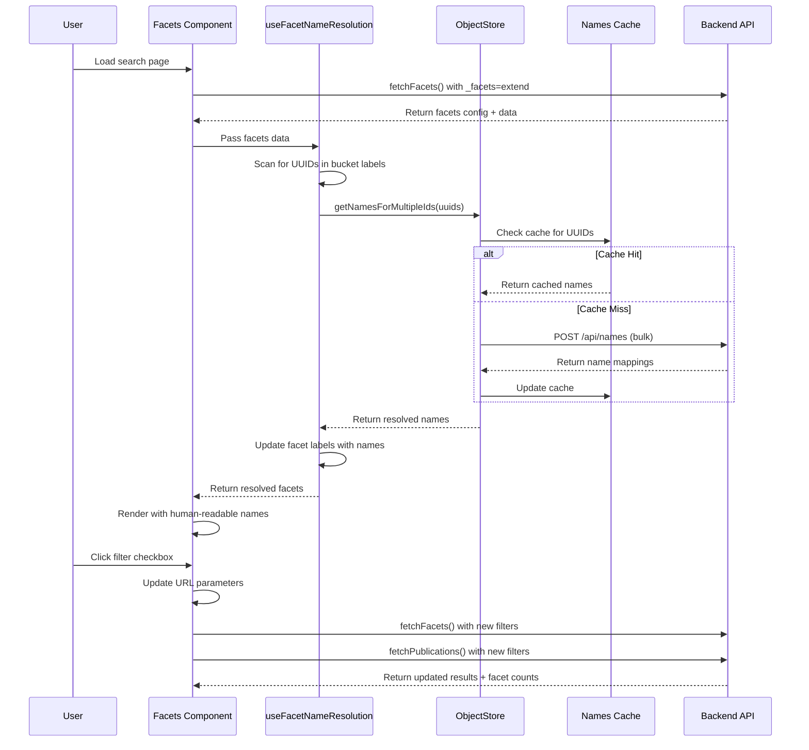

# Facets Filter System

## Overview

Het Facets Filter System is een geavanceerd frontend systeem voor het **dynamisch filteren van publicaties** in de Tilburg WOO UI applicatie. Het systeem gebruikt **API-driven configuratie** en integreert **automatische UUID-naar-naam resolutie** voor een optimale gebruikerservaring.

## System Architecture

Het systeem bestaat uit meerdere geïntegreerde componenten die samenwerken voor efficiënte facet filtering:



## Core Components

### 1. **ConFacetsFilters Component**
**File**: `src/molecules/con-facets-filters/con-facets-filters.js`

Het hoofdcomponent dat de facet filters rendert met de volgende functionaliteiten:

- ✅ **API-Driven Configuration**: Gebruikt facet configuratie direct van de backend
- ✅ **Automatic UUID Resolution**: Zet UUIDs automatisch om naar leesbare namen
- ✅ **Loading States**: Toont laad-indicatoren tijdens naam resolutie
- ✅ **Tooltips**: Facet titels tonen beschrijvingen, resolved namen tonen originele UUIDs
- ✅ **Real-time Updates**: Facet counts worden bijgewerkt bij filter wijzigingen

### 2. **useFacetNameResolution Hook**
**File**: `src/hooks/con-use-facet-name-resolution.js`

Een custom React hook die UUID labels in facet buckets automatisch resolved naar namen:

```javascript
const { resolvedFacets, isResolving } = useFacetNameResolution(facets, objectStore);
```

**Features**:
- **Bulk Resolution**: Verzamelt alle UUIDs en resolved ze in één API call
- **Cache Integration**: Gebruikt het bestaande names cache systeem
- **Error Handling**: Graceful fallback naar originele facets bij fouten
- **Performance**: Alleen resolution wanneer nodig

### 3. **Publications Store Integration**
**File**: `src/stores/publications.store.js`

De store verwerkt de nieuwe facets API response structuur:

```javascript
// API Response Structure
{
  "facets": {
    "_register": {
      "name": "_register",
      "title": "Register",
      "description": "Register that contains the object",
      "enabled": true,
      "queryParameter": "@self[register]",
      "data": {
        "buckets": [{"value": 1, "count": 2, "label": "1"}]
      }
    }
  },
  "facetable": { /* configuration reference */ }
}
```

## API Integration

### Facets Endpoint
```
GET /api/apps/opencatalogi/api/publications?_source=index&_limit=0&_facets=extend
```

**Response Structure**:
- `facets`: Object met facet configuratie + data gecombineerd
- `facetable`: Referentie configuratie voor alle beschikbare facets

### Names Resolution Endpoint
```
POST /api/names
Content-Type: application/json

["uuid-1", "uuid-2", "uuid-3"]
```

**Response**:
```json
{
  "names": {
    "uuid-1": "Gemeente Amsterdam",
    "uuid-2": "VNG Realisatie",
    "uuid-3": "Test Organisation"
  }
}
```

## User Experience Flow

### Before UUID Resolution
```
Filters
├── Register
│   └── ☐ 1 (13)
├── Schema  
│   └── ☐ 7 (13)
└── Organisation
    ├── ☐ 2c0837b6-0df5-4572-a423-f8cc5da08fb9 (9)
    └── ☐ 43816ac1-aee0-4683-be04-032e269e037d (3)
```

### After UUID Resolution
```
Filters                    [Namen ophalen...]
├── Register (hover: "Register that contains the object")
│   └── ☐ 1 (13)
├── Schema (hover: "Schema that defines the object structure")
│   └── ☐ 7 (13)  
└── Organisation (hover: "Organisation that owns the object")
    ├── ☐ Test Org 2 (9) (hover: "Origineel: 2c0837b6-...")
    └── ☐ Gemeente Amsterdam (3) (hover: "Origineel: 43816ac1-...")
```

## Performance Optimizations

### 1. **Bulk UUID Resolution**
- Verzamelt alle UUIDs uit alle facet buckets
- Maakt één API call voor alle UUIDs tegelijk
- Gebruikt bestaande names cache voor hergebruik

### 2. **Smart Loading States**
- Toont skeleton loading alleen wanneer nodig
- Separate loading indicator voor naam resolutie
- Niet-blocking: filters blijven functioneel tijdens resolutie

### 3. **Cache Strategy**
- Hergebruikt bestaande ObjectStore names cache
- TTL van 30 minuten voor resolved namen
- Cache-first strategie met backend fallback

## Configuration

### Facet Properties
Elke facet ondersteunt de volgende configuratie van de backend:

```javascript
{
  "name": "_organisation",           // Facet identifier
  "title": "Organisation",           // Display title
  "description": "Organisation...",  // Tooltip description
  "enabled": true,                   // Show/hide facet
  "queryParameter": "@self[organisation]", // URL parameter
  "type": "terms",                   // Facet type
  "order": 0,                        // Display order
  "data": {
    "buckets": [...]                 // Actual facet data
  }
}
```

### Supported Facet Types
- ✅ **terms**: Standard facet met discrete waarden
- ✅ **@self facets**: Geneste metadata facets (register, schema, organisation)
- ⏳ **date_histogram**: Datum-gebaseerde facets (gereserveerd voor toekomst)

## Error Handling

### UUID Resolution Failures
- **Graceful Degradation**: Toont originele UUID als naam niet gevonden
- **Batch Resilience**: Individuele UUID failures breken niet de hele batch
- **Console Logging**: Duidelijke error messages voor debugging

### API Failures
- **Fallback Strategy**: Gebruikt cached data indien beschikbaar
- **Empty State Handling**: Toont "Geen filters beschikbaar" bij API fouten
- **Retry Logic**: Automatische retry bij netwerkfouten

## Development Guidelines

### Adding New Facet Types
1. Update `fetchFacets()` in publications store
2. Add type-specific handling in filter component
3. Test with enabled/disabled states
4. Verify UUID resolution works for new type

### Extending UUID Resolution
- Hook werkt automatisch voor alle facet types
- Voeg nieuwe UUID patterns toe aan `isUUID()` utility
- Test bulk resolution performance met grote datasets

### Debugging
- Console logs tonen facet processing stappen
- Tooltips tonen originele UUIDs voor verificatie
- Browser dev tools tonen names cache inhoud

## Future Enhancements

### Planned Features
- 🔄 **Date Histogram Support**: Datum-gebaseerde filtering
- 🎨 **Custom Facet Rendering**: Type-specifieke UI components
- 📊 **Facet Analytics**: Usage tracking en optimization
- 🔍 **Search Within Facets**: Filter grote facet lijsten

### Performance Improvements
- 🚀 **Virtual Scrolling**: Voor facets met veel opties
- 💾 **Persistent Cache**: LocalStorage voor names cache
- ⚡ **Incremental Loading**: Lazy load facet data
- 🔄 **Background Refresh**: Update facets zonder gebruikersinterruptie

## Technical Specifications

### Dependencies
- React 18+ met hooks support
- MobX voor state management  
- Utrecht Design System voor UI components
- Existing names cache system

### Browser Support
- Chrome 90+
- Firefox 88+
- Safari 14+
- Edge 90+

### Performance Metrics
- **Initial Load**: < 2s voor facets rendering
- **UUID Resolution**: < 500ms voor bulk resolution
- **Filter Updates**: < 100ms voor UI updates
- **Memory Usage**: < 5MB voor names cache

---

## Conclusion

Het Facets Filter System biedt een robuuste, performante en gebruiksvriendelijke oplossing voor dynamische filtering met automatische naam resolutie. Door de integratie met het bestaande names cache systeem en API-driven configuratie is het systeem zowel flexibel als onderhoudbaar.
