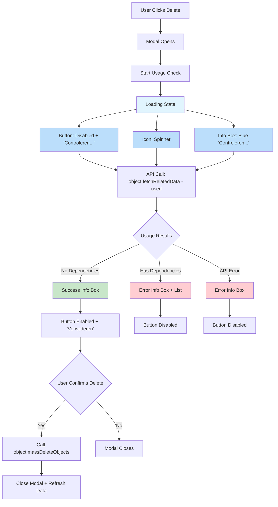
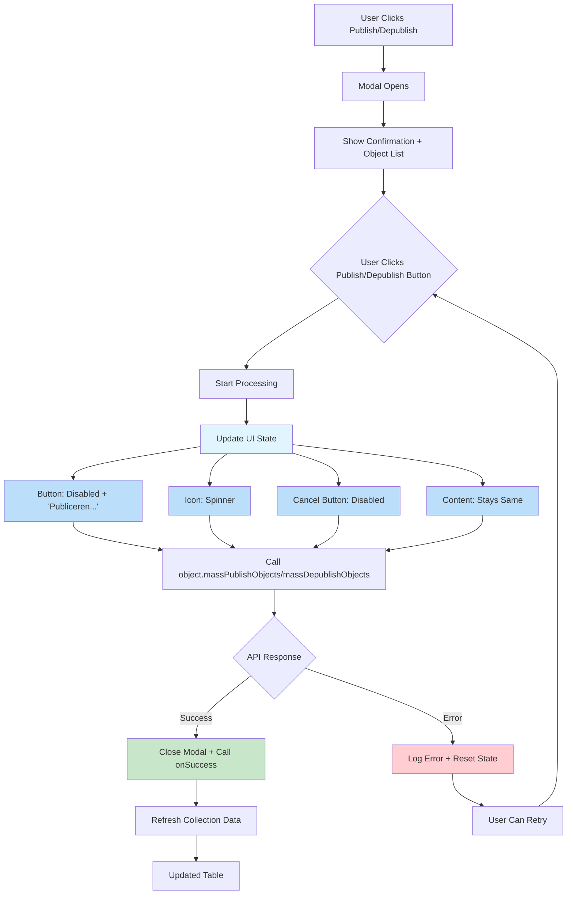
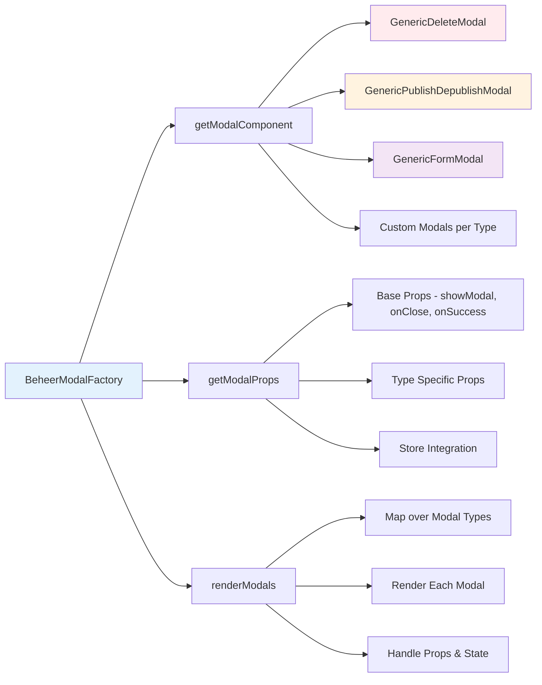

# Modal System Documentation

## Overview

Het Tilburg WOO UI project gebruikt een gestandaardiseerd modal systeem voor alle CRUD operaties in de beheer sectie. Dit systeem ondersteunt verschillende soorten modals met loading states, usage checks, en consistent UX design.

## Modal Types

### 1. Delete Modal (`ac-generic-beheer-delete-modal`)

**Features:**
- Usage check via `/used` endpoint
- Loading states met spinners
- Kleurgecodeerde info boxes (success/error)
- Object dependency lijst
- Smart button disabling

**Workflow:**



### 2. Publish/Depublish Modal (`ac-generic-beheer-publish-depublish-modal`)

**Features:**
- Loading states tijdens operatie
- Button label/icon wijzigingen
- Content blijft consistent zichtbaar
- Both buttons disabled tijdens processing

**Workflow:**



### 3. Form Modal (`con-generic-form-modal`)

**Features:**
- Dynamic schema-based forms
- Field validation
- Success countdown
- Loading states voor submit

## Factory Pattern

Het modal systeem gebruikt het Factory pattern voor consistency:



## State Management

### Loading States
- **Delete Modal:** Usage checking, button loading
- **Publish Modal:** Processing state, button loading  
- **Form Modal:** Submit loading, field loading

### Error Handling
- **API Errors:** Logged to console, user-facing messages
- **Validation Errors:** Field-level feedback
- **Network Errors:** Graceful degradation

### Success States
- **Auto-refresh:** Collections refreshed after operations
- **Visual feedback:** Success messages, countdowns
- **State cleanup:** Modal state reset on close

## UX Patterns

### Consistent Visual Language
- **🔄 Blue:** Loading/processing states
- **✅ Green:** Success/safe operations  
- **❌ Red:** Errors/dangerous operations
- **⚠️ Yellow:** Warnings

### Button Behavior
- **Disabled tijdens loading** - prevent double-clicks
- **Dynamic labels** - "Verwijderen..." tijdens loading
- **Icon changes** - Spinner tijdens processing
- **Loading attribute** - Extra visuele feedback

### Content Strategy
- **Persistent confirmation** - Content blijft zichtbaar
- **Object lists** - Altijd tonen wat beïnvloed wordt
- **Contextual info** - Type-specific guidance
- **Progressive disclosure** - Info boxes voor details

## Implementation Guidelines

### Adding New Modal Types

1. **Create modal component** in `src/views/ac-beheer/core/modals/`
2. **Register in factory** via `BeheerModalFactory.modalComponents`
3. **Add props logic** in `getModalProps` method
4. **Follow UX patterns** voor consistency

### Usage Check Implementation

```javascript
// In delete modal
const checkObjectUsage = useCallback(async () => {
  const usageResults = await Promise.allSettled(
    objects.map(async (obj) => {
      const metadata = obj['@self'];
      await object.fetchRelatedData(
        metadata.register, 
        metadata.schema, 
        obj.id, 
        'used',
        { _limit: 100 }
      );
      
      const type = `${metadata.register}_${metadata.schema}`;
      const relatedData = object.getRelatedData(type, 'used');
      return {
        objectId: obj.id,
        objectName: metadata.name || obj.naam || obj.name || obj.id,
        used: relatedData?.results || [],
      };
    })
  );
  
  setUsageData(processedResults);
}, [objects, object]);
```

### Loading State Pattern

```javascript
// Standard loading state implementation
const [isProcessing, setIsProcessing] = useState(false);

const handleAction = async () => {
  if (isProcessing) return; // Prevent double-clicks
  
  setIsProcessing(true);
  try {
    await performAction();
    // Success handling
  } catch (err) {
    // Error handling  
  } finally {
    setIsProcessing(false);
  }
};

// Button configuration
{
  label: isProcessing ? 'Processing...' : 'Action',
  icon: isProcessing ? <VISUALS.SPINNER /> : <VISUALS.ACTION />,
  disabled: isProcessing,
  loading: isProcessing,
}
```

## Testing Guidelines

### Manual Testing Checklist
- [ ] Modal opens correctly
- [ ] Loading states work
- [ ] Buttons disabled tijdens processing
- [ ] Error states handled gracefully
- [ ] Success flow completes
- [ ] Data refreshes after operations
- [ ] Modal closes properly
- [ ] State cleanup on close

### Edge Cases
- [ ] API timeouts
- [ ] Network errors  
- [ ] Empty data sets
- [ ] Permission denied
- [ ] Concurrent operations

## Future Improvements

### Planned Features
- **Bulk operation progress bars**
- **Enhanced error messages**
- **Undo functionality**
- **Keyboard shortcuts**
- **Accessibility improvements**

### Performance Optimizations
- **Request caching** voor usage checks
- **Debounced validation** in forms  
- **Virtual scrolling** voor lange lijsten
- **Lazy loading** van modal content
