# Names Cache System

## Overview

Het Names Cache System is een geavanceerd frontend systeem voor het **snel omzetten van UUIDs naar leesbare namen** in de Tilburg WOO UI applicatie. Het systeem ondersteunt **single references** en **arrays van references** met een multi-layer caching strategie voor optimale performance en gebruikerservaring.

## System Architecture

Het systeem bestaat uit meerdere geïntegreerde componenten die samenwerken voor efficiënte UUID → Name resolutie:

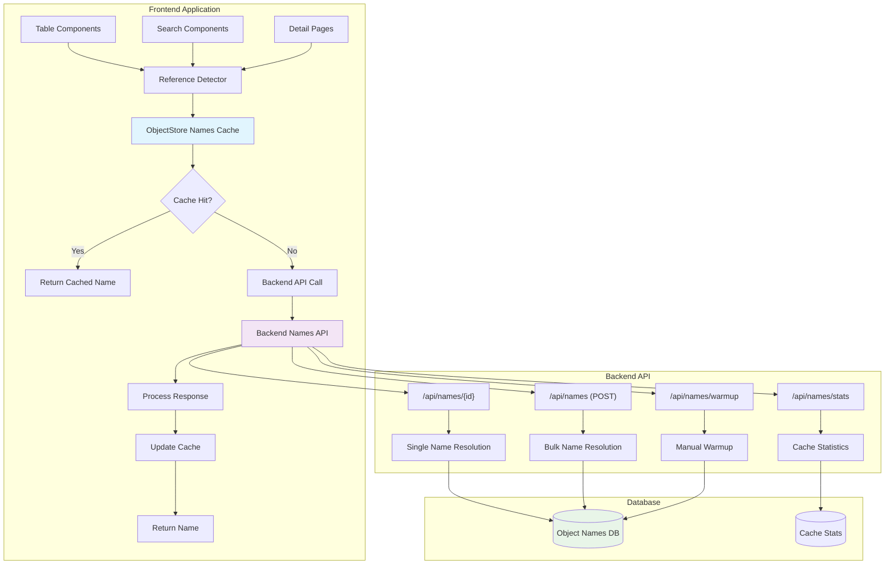
```mermaid
flowchart TB
    subgraph "Frontend Application"
        A[Table Components] --> B[Reference Detector]
        C[Search Components] --> B
        D[Detail Pages] --> B
        
        B --> E[ObjectStore Names Cache]
        
        E --> F{Cache Hit?}
        F -->|Yes| G[Return Cached Name]
        F -->|No| H[Backend API Call]
        
        H --> I[Backend Names API]
        I --> J[Process Response]
        J --> K[Update Cache]
        K --> L[Return Name]
    end
    
    subgraph "Backend API"
        I --> M["/api/names/{id}"]
        I --> N["/api/names (POST)"]
        I --> O["/api/names/stats"]
        I --> P["/api/names/warmup"]
        
        M --> Q[Single Name Resolution]
        N --> R[Bulk Name Resolution]
        O --> S[Cache Statistics]
        P --> T[Manual Warmup]
    end
    
    subgraph "Database"
        Q --> U[(Object Names DB)]
        R --> U
        S --> V[(Cache Stats)]
        T --> U
    end
    
    style E fill:#e1f5fe
    style I fill:#f3e5f5
    style U fill:#e8f5e8
```

## Core Components

### 1. ObjectStore Names Cache

Het hart van het systeem bevindt zich in `src/stores/object.store.js`:

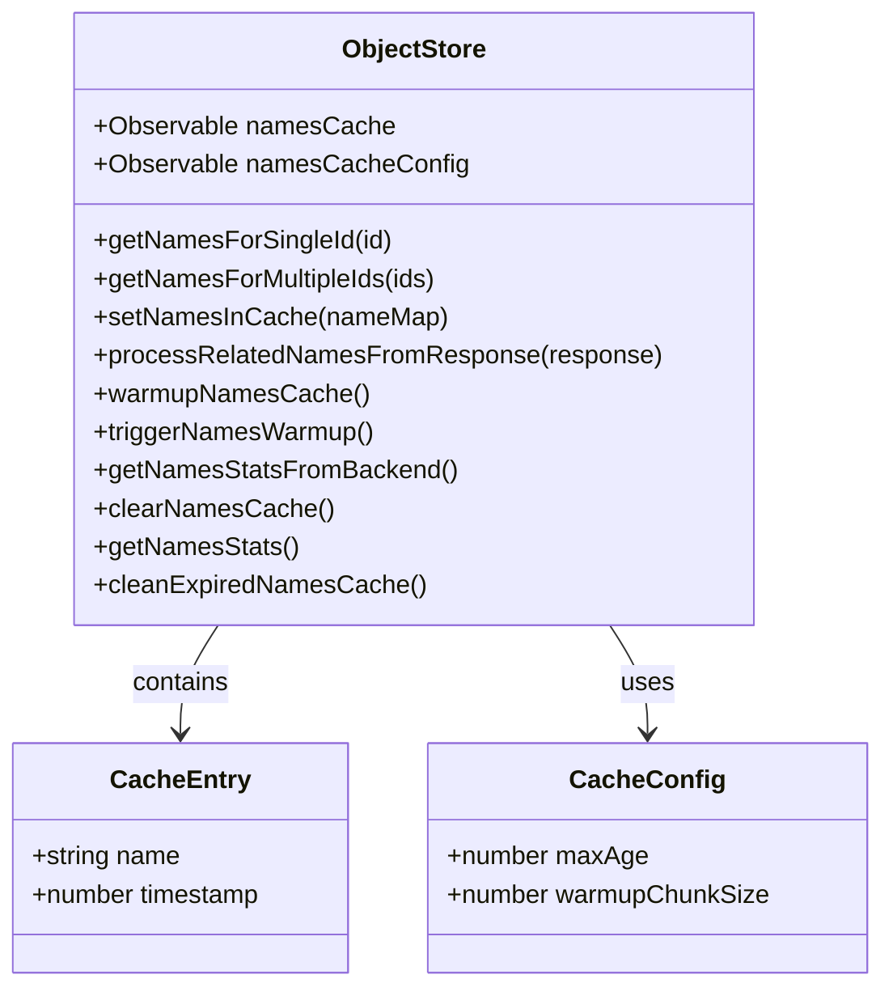
```mermaid
classDiagram
    class ObjectStore {
        +Observable namesCache
        +Observable namesCacheConfig
        +getNamesForSingleId(id)
        +getNamesForMultipleIds(ids)
        +setNamesInCache(nameMap)
        +processRelatedNamesFromResponse(response)
        +warmupNamesCache()
        +triggerNamesWarmup()
        +getNamesStatsFromBackend()
        +clearNamesCache()
        +getNamesStats()
        +cleanExpiredNamesCache()
    }
    
    class CacheEntry {
        +string name
        +number timestamp
    }
    
    class CacheConfig {
        +number maxAge
        +number warmupChunkSize
    }
    
    ObjectStore --> CacheEntry : contains
    ObjectStore --> CacheConfig : uses
```

### 2. Reference Detection Utilities

Smart detectie van UUID referenties in `src/utilities/con-detect-object-references.js`:

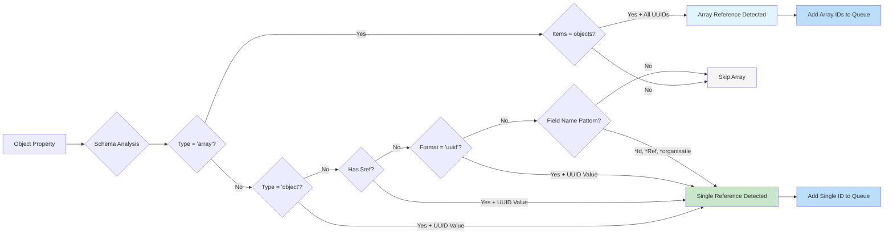
```mermaid
flowchart LR
    A[Object Property] --> B{Schema Analysis}
    
    B --> C{Type = 'array'?}
    C -->|Yes| D{Items = objects?}
    D -->|Yes + All UUIDs| E[Array Reference Detected]
    D -->|No| F[Skip Array]
    
    C -->|No| G{Type = 'object'?}
    G -->|Yes + UUID Value| H[Single Reference Detected]
    
    G -->|No| I{Has $ref?}
    I -->|Yes + UUID Value| H
    
    I -->|No| J{Format = 'uuid'?}
    J -->|Yes + UUID Value| H
    
    J -->|No| K{Field Name Pattern?}
    K -->|*Id, *Ref, *organisatie| H
    K -->|No| F
    
    E --> L[Add Array IDs to Queue]
    H --> M[Add Single ID to Queue]
    
    style E fill:#e1f5fe
    style H fill:#c8e6c9
    style L fill:#bbdefb
    style M fill:#bbdefb
    style F fill:#f5f5f5
```

### 2.1 Array Reference Support

Het systeem ondersteunt nu ook **arrays van object referenties**. Wanneer een schema property `type: "array"` heeft met `items: { type: "object" }`, worden arrays van UUID strings automatisch gedetecteerd en opgelost:

```javascript
// Schema Example
{
  "organisaties": {
    "type": "array",
    "items": { "type": "object" }
  }
}

// API Response
{
  "organisaties": ["uuid-1", "uuid-2", "uuid-3"]
}

// Display Result
"Gemeente Amsterdam, VNG Realisatie, +1 meer"
```

**Weergave Logica**:
- **≤ 3 items**: Alle namen weergegeven (`"Naam 1, Naam 2, Naam 3"`)  
- **> 3 items**: Eerste 2 namen + aantal overige (`"Naam 1, Naam 2, +2 meer"`)
- **Tooltip**: Toont originele UUID array voor debugging

## Cache Resolution Flow

Het cache systeem gebruikt een **optimistische cache-first strategie** met parallelle warmup voor optimale performance:

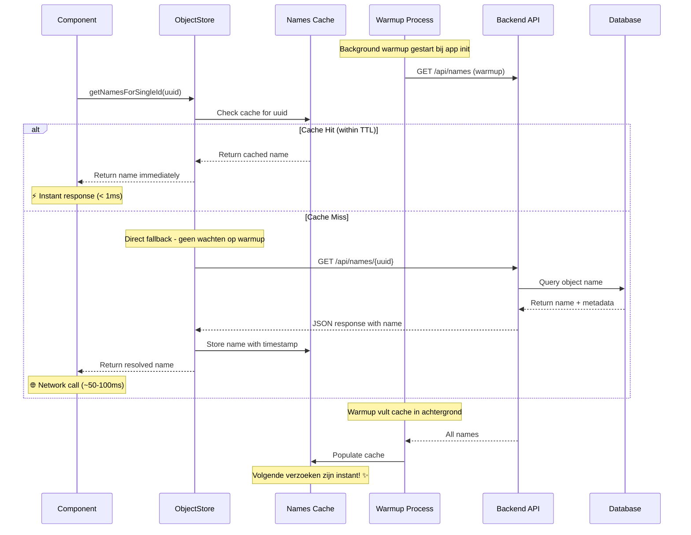
```mermaid
sequenceDiagram
    participant C as Component
    participant OS as ObjectStore
    participant Cache as Names Cache
    participant Warmup as Warmup Process
    participant API as Backend API
    participant DB as Database
    
    Note over Warmup: Background warmup gestart bij app init
    Warmup->>API: GET /api/names (warmup)
    
    C->>OS: getNamesForSingleId(uuid)
    OS->>Cache: Check cache for uuid
    
    alt Cache Hit (within TTL)
        Cache-->>OS: Return cached name
        OS-->>C: Return name immediately
        Note over C: ⚡ Instant response (< 1ms)
    else Cache Miss
        Note over OS: Direct fallback - geen wachten op warmup
        OS->>API: GET /api/names/{uuid}
        API->>DB: Query object name
        DB-->>API: Return name + metadata
        API-->>OS: JSON response with name
        OS->>Cache: Store name with timestamp
        OS-->>C: Return resolved name
        Note over C: 🌐 Network call (~50-100ms)
    end
    
    Note over Warmup: Warmup vult cache in achtergrond
    API-->>Warmup: All names
    Warmup->>Cache: Populate cache
    Note over Cache: Volgende verzoeken zijn instant! ✨
```

**Belangrijke optimalisatie:**
- **Geen blokkerende warmup**: Components wachten NIET op de volledige warmup
- **Direct fallback**: Individuele UUID's worden direct opgehaald als ze niet in cache zitten
- **Parallelle processing**: Warmup en individual fetches lopen parallel
- **Progressieve verbetering**: Naarmate warmup vordert, zijn meer names al in cache

**Voor en na warmup gedrag:**
- **Tijdens warmup**: Individual API calls voor missing UUIDs (componenten blijven responsive)
- **Na warmup**: Instant cache hits voor alle UUIDs (optimale performance)

## Loading State Optimization

De loading states in de UI zijn **volledig ontkoppeld** van de warmup process voor optimale gebruikerservaring:

```mermaid
flowchart TD
    A[Component renders with UUID] --> B[useResolvedText hook]
    
    B --> C{Cache Hit?}
    C -->|Yes| D[Show Name Immediately]
    D --> E[isLoading: false]
    
    C -->|No| F[isLoading: true]
    F --> G[Show 'Loading...']
    
    G --> H[Individual UUID Fetch]
    H --> I[UUID Resolved]
    I --> J[Update UI with Name]
    J --> K[isLoading: false]
    
    Note over G,H: Warmup NOT blocking
    Note over H: ~50-100ms response
    
    subgraph "Background Process (Non-blocking)"
        L[Warmup Process]
        L --> M[Populate Cache]
    end
    
    style D fill:#c8e6c9
    style K fill:#c8e6c9
    style G fill:#fff3e0
    style L fill:#e3f2fd
```

**Belangrijke eigenschappen:**
- **Geen warmup dependency**: `isLoading` hangt NIET af van warmup status
- **Per-UUID loading**: Elke UUID heeft zijn eigen loading state
- **Immediate feedback**: Loading verdwijnt zodra de individuele UUID is opgehaald
- **Progressive rendering**: Names verschijnen zodra ze beschikbaar zijn

**Voor en na de fix:**

| Aspect | Voor (Blocking) | Na (Optimized) |
|--------|----------------|----------------|
| Loading state | Geblokkeerd tot warmup compleet | Alleen tijdens actual fetch |
| UI rendering | Wacht op volledige warmup | Immediate render |
| Filter display | ~5-30 seconden delay | ~50-100ms per UUID |
| User experience | Lange loading spinners | Snelle, responsive UI |

## Bulk Resolution Optimization

Voor meerdere UUIDs gebruikt het systeem **bulk resolution** voor optimale performance:

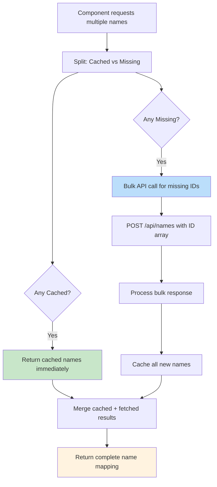
```mermaid
flowchart TD
    A[Component requests multiple names] --> B[Split: Cached vs Missing]
    
    B --> C{Any Cached?}
    C -->|Yes| D[Return cached names immediately]
    
    B --> E{Any Missing?}
    E -->|Yes| F[Bulk API call for missing IDs]
    
    F --> G[POST /api/names with ID array]
    G --> H[Process bulk response]
    H --> I[Cache all new names]
    
    D --> J[Merge cached + fetched results]
    I --> J
    J --> K[Return complete name mapping]
    
    style D fill:#c8e6c9
    style F fill:#bbdefb
    style K fill:#fff3e0
```

## Table Integration Flow

Automatische UUID → Name conversie in dashboard tabellen:

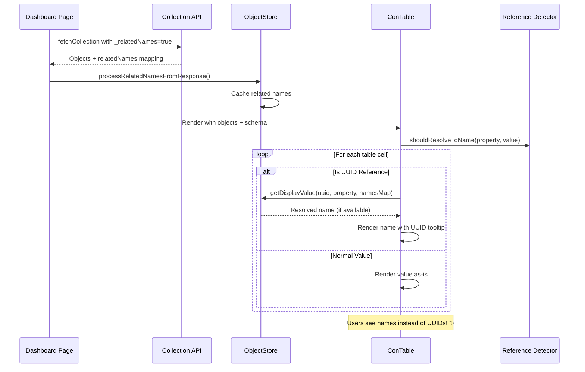
```mermaid
sequenceDiagram
    participant Page as Dashboard Page
    participant API as Collection API
    participant Store as ObjectStore
    participant Table as ConTable
    participant Detector as Reference Detector
    
    Page->>API: fetchCollection with _relatedNames=true
    API-->>Page: Objects + relatedNames mapping
    
    Page->>Store: processRelatedNamesFromResponse()
    Store->>Store: Cache related names
    
    Page->>Table: Render with objects + schema
    Table->>Detector: shouldResolveToName(property, value)
    
    loop For each table cell
        alt Is UUID Reference
            Table->>Store: getDisplayValue(uuid, property, namesMap)
            Store-->>Table: Resolved name (if available)
            Table->>Table: Render name with UUID tooltip
        else Normal Value
            Table->>Table: Render value as-is
        end
    end
    
    Note over Table: Users see names instead of UUIDs! ✨
```

## Search Page Integration

Namen cache integratie voor de search pagina zorgt voor betere UX door UUIDs te vervangen met leesbare namen:

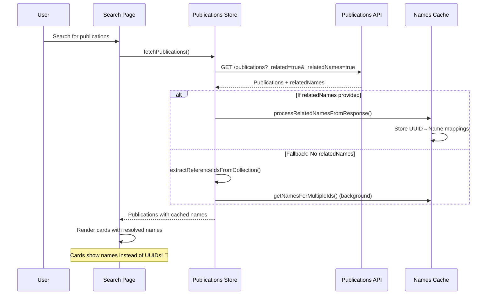
```mermaid
sequenceDiagram
    participant User as User
    participant Search as Search Page
    participant Store as Publications Store
    participant API as Publications API
    participant Cache as Names Cache
    
    User->>Search: Search for publications
    Search->>Store: fetchPublications()
    Store->>API: GET /publications?_related=true&_relatedNames=true
    API-->>Store: Publications + relatedNames
    
    alt If relatedNames provided
        Store->>Cache: processRelatedNamesFromResponse()
        Cache->>Cache: Store UUID→Name mappings
    else Fallback: No relatedNames
        Store->>Store: extractReferenceIdsFromCollection()
        Store->>Cache: getNamesForMultipleIds() (background)
    end
    
    Store-->>Search: Publications with cached names
    Search->>Search: Render cards with resolved names
    
    Note over Search: Cards show names instead of UUIDs! 🎯
```

## API Integration Patterns

Het systeem integreert naadloos met alle backend Names API endpoints:

```mermaid
flowchart LR
    subgraph "Frontend Methods"
        A[getNamesForSingleId]
        B[getNamesForMultipleIds]
        C[warmupNamesCache]
        D[triggerNamesWarmup]
        E[getNamesStatsFromBackend]
    end
    
    subgraph "Backend Endpoints"
        F[GET /api/names/{id}]
        G[POST /api/names]
        H[GET /api/names]
        I[POST /api/names/warmup]
        J[GET /api/names/stats]
    end
    
    A --> F
    B --> G
    C --> H
    D --> I
    E --> J
    
    subgraph "Response Formats"
        F --> K[Single: names.id]
        G --> L[Bulk: names object + stats]
        H --> M[All: names object + metadata]
        I --> N[Warmup: execution stats]
        J --> O[Stats: cache performance]
    end
    
    style A fill:#e1f5fe
    style G fill:#f3e5f5
    style L fill:#fff3e0
```

## Error Handling & Resilience

Robuuste error handling zorgt voor graceful degradation:

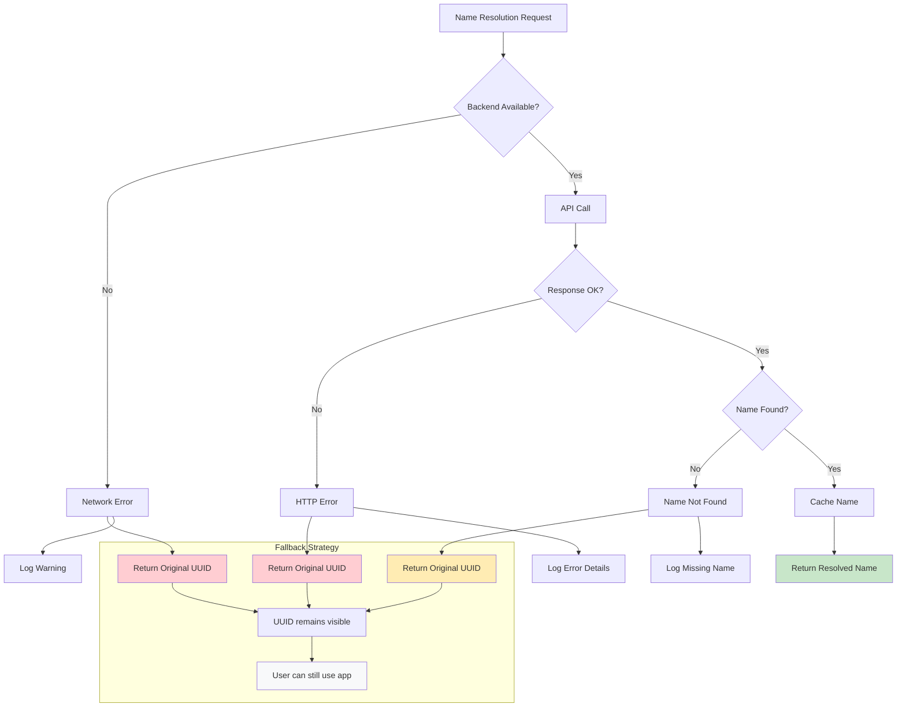
```mermaid
flowchart TD
    A[Name Resolution Request] --> B{Backend Available?}
    
    B -->|No| C[Network Error]
    C --> D[Return Original UUID]
    C --> E[Log Warning]
    
    B -->|Yes| F[API Call]
    F --> G{Response OK?}
    
    G -->|No| H[HTTP Error]
    H --> I[Return Original UUID]
    H --> J[Log Error Details]
    
    G -->|Yes| K{Name Found?}
    K -->|No| L[Name Not Found]
    L --> M[Return Original UUID]
    L --> N[Log Missing Name]
    
    K -->|Yes| O[Cache Name]
    O --> P[Return Resolved Name]
    
    subgraph "Fallback Strategy"
        D --> Q[UUID remains visible]
        I --> Q
        M --> Q
        Q --> R[User can still use app]
    end
    
    style D fill:#ffcdd2
    style I fill:#ffcdd2
    style M fill:#ffecb3
    style P fill:#c8e6c9
    style R fill:#f8f9fa
```

## Performance Optimization Flow

Multi-layer caching zorgt voor optimale performance:

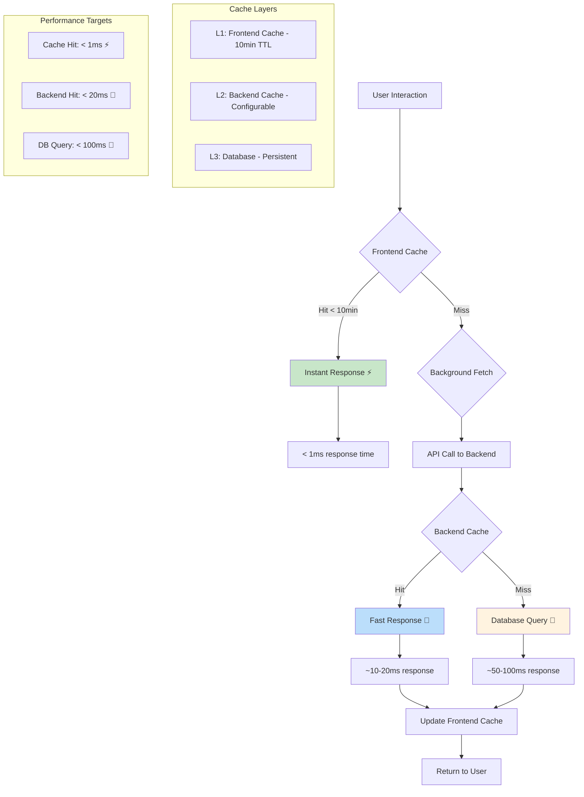
```mermaid
flowchart TD
    A[User Interaction] --> B{Frontend Cache}
    
    B -->|Hit < 10min| C[Instant Response ⚡]
    C --> D[< 1ms response time]
    
    B -->|Miss| E{Background Fetch}
    E --> F[API Call to Backend]
    
    F --> G{Backend Cache}
    G -->|Hit| H[Fast Response 🚀]
    G -->|Miss| I[Database Query 💾]
    
    H --> J[~10-20ms response]
    I --> K[~50-100ms response]
    
    J --> L[Update Frontend Cache]
    K --> L
    L --> M[Return to User]
    
    subgraph "Cache Layers"
        N[L1: Frontend Cache - 10min TTL]
        O[L2: Backend Cache - Configurable]
        P[L3: Database - Persistent]
    end
    
    subgraph "Performance Targets"
        Q[Cache Hit: < 1ms ⚡]
        R[Backend Hit: < 20ms 🚀]
        S[DB Query: < 100ms 💾]
    end
    
    style C fill:#c8e6c9
    style H fill:#bbdefb
    style I fill:#fff3e0
```

## Collection Processing Workflow

Automatische verwerking van object collecties met names resolution:

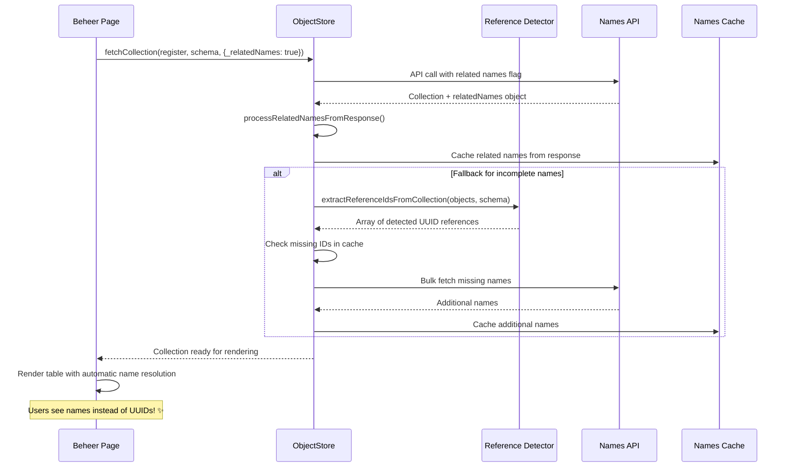
```mermaid
sequenceDiagram
    participant Page as Beheer Page
    participant Store as ObjectStore
    participant Detector as Reference Detector
    participant API as Names API
    participant Cache as Names Cache
    
    Page->>Store: fetchCollection(register, schema, {_relatedNames: true})
    Store->>API: API call with related names flag
    API-->>Store: Collection + relatedNames object
    
    Store->>Store: processRelatedNamesFromResponse()
    Store->>Cache: Cache related names from response
    
    alt Fallback for incomplete names
        Store->>Detector: extractReferenceIdsFromCollection(objects, schema)
        Detector-->>Store: Array of detected UUID references
        
        Store->>Store: Check missing IDs in cache
        Store->>API: Bulk fetch missing names
        API-->>Store: Additional names
        Store->>Cache: Cache additional names
    end
    
    Store-->>Page: Collection ready for rendering
    Page->>Page: Render table with automatic name resolution
    
    Note over Page: Users see names instead of UUIDs! ✨
```

## Cache Lifecycle Management

Intelligent cache management voor optimale memory usage:

```mermaid
stateDiagram-v2
    [*] --> Empty : Application Start
    
    Empty --> Warming : Manual/Auto Warmup
    Warming --> Populated : Warmup Complete
    
    Populated --> Hit : Cache Request
    Hit --> Populated : Return Cached Name
    
    Populated --> Miss : Cache Request
    Miss --> Fetching : Backend API Call
    Fetching --> Updated : Store New Name
    Updated --> Populated : Cache Updated
    
    Populated --> Expiring : TTL Exceeded
    Expiring --> Cleaning : Cleanup Process
    Cleaning --> Populated : Expired Entries Removed
    
    Populated --> Clearing : Manual Clear
    Clearing --> Empty : Cache Cleared
    
    Populated --> Invalidating : CRUD Operation
    Invalidating --> Populated : Selective Invalidation
    
    note right of Populated : TTL: 10 minutes
    note right of Cleaning : Auto cleanup on access
    note right of Invalidating : After create/update/delete
```

## Integration Checklist

Voor implementatie in nieuwe componenten:

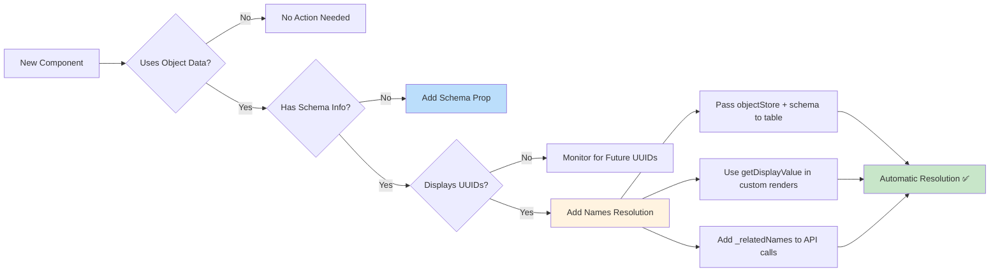
```mermaid
flowchart LR
    A[New Component] --> B{Uses Object Data?}
    B -->|No| C[No Action Needed]
    
    B -->|Yes| D{Has Schema Info?}
    D -->|No| E[Add Schema Prop]
    
    D -->|Yes| F{Displays UUIDs?}
    F -->|No| G[Monitor for Future UUIDs]
    
    F -->|Yes| H[Add Names Resolution]
    H --> I[Pass objectStore + schema to table]
    H --> J[Use getDisplayValue in custom renders]
    H --> K[Add _relatedNames to API calls]
    
    I --> L[Automatic Resolution ✅]
    J --> L
    K --> L
    
    style L fill:#c8e6c9
    style E fill:#bbdefb
    style H fill:#fff3e0
```

## Usage Examples

### Basic Implementation in Table Component

```javascript
// 1. Add names resolution props to ConTable
<ConTable
  data={objects}
  tableHeaders={headers}
  // Names resolution props
  objectStore={object}
  schema={schemaData}
/>
```

### Manual Name Resolution

```javascript
// 2. Manual resolution in custom components
const { object } = store;

// Single name resolution
const name = await object.getNamesForSingleId('uuid-123');

// Multiple names resolution
const names = await object.getNamesForMultipleIds(['uuid-1', 'uuid-2']);

// Process API response with related names
object.processRelatedNamesFromResponse(apiResponse);
```

### API Integration with Related Names

```javascript
// 3. API calls with related names support
const storeParams = {
  _page: 1,
  _limit: 20,
  _related: true,        // Request related object data
  _relatedNames: true,   // Request ID → name mappings
};

await object.fetchCollection(register, schema, storeParams);
```

### Cache Management

```javascript
// 4. Cache management operations
// Warmup cache with all available names
await object.warmupNamesCache();

// Trigger backend warmup
await object.triggerNamesWarmup();

// Get cache statistics
const stats = object.getNamesStats();
const backendStats = await object.getNamesStatsFromBackend();

// Clear cache
object.clearNamesCache();
```

## Performance Metrics

Het systeem biedt uitgebreide performance monitoring:

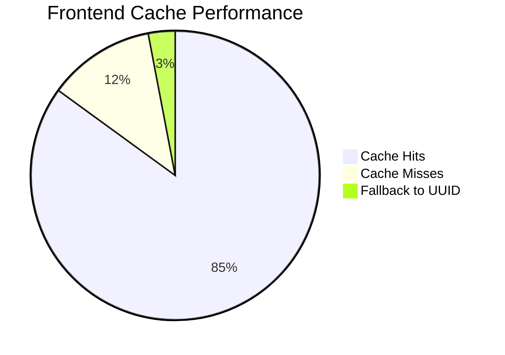
```mermaid
pie title Frontend Cache Performance
    "Cache Hits" : 85
    "Cache Misses" : 12
    "Fallback to UUID" : 3
```

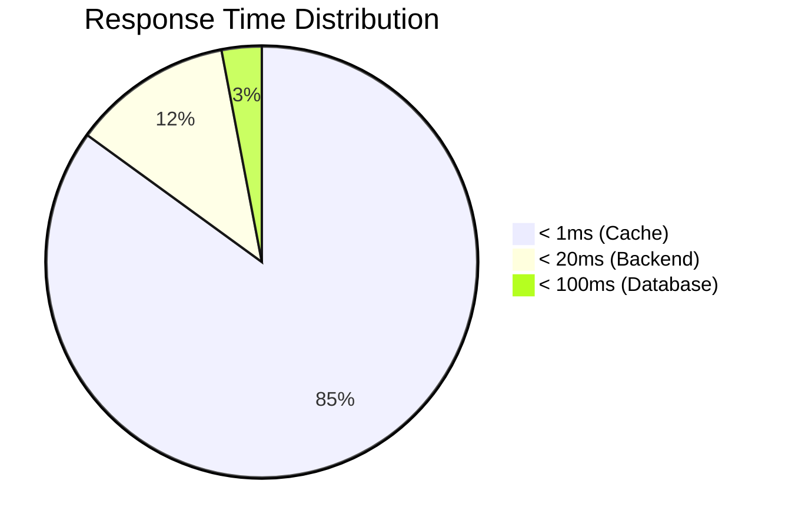
```mermaid
pie title Response Time Distribution
    "< 1ms (Cache)" : 85
    "< 20ms (Backend)" : 12
    "< 100ms (Database)" : 3
```

## Testing Strategy

Uitgebreide test coverage voor alle componenten:

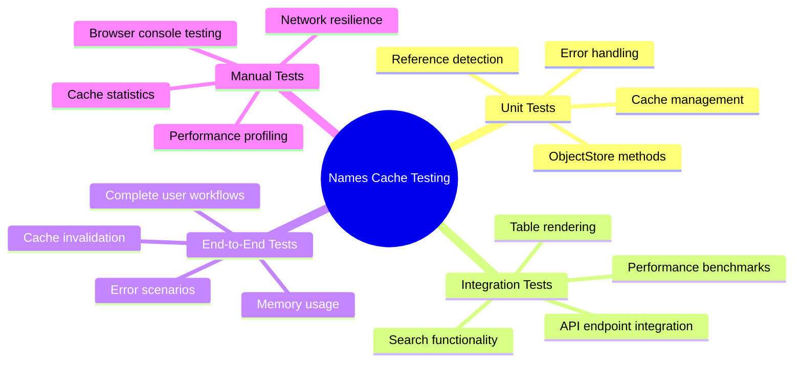
```mermaid
mindmap
  root((Names Cache Testing))
    Unit Tests
      ObjectStore methods
      Reference detection
      Cache management
      Error handling
    Integration Tests
      API endpoint integration
      Table rendering
      Search functionality
      Performance benchmarks
    End-to-End Tests
      Complete user workflows
      Error scenarios
      Cache invalidation
      Memory usage
    Manual Tests
      Browser console testing
      Performance profiling
      Network resilience
      Cache statistics
```

### Live Backend Testing

⚠️ **BELANGRIJKE OPMERKING**: De implementatie is gebaseerd op de backend API specificatie maar **nog niet daadwerkelijk getest** tegen de running backend.

Voor **echte verificatie** van de implementatie, gebruik de ingebouwde test suite:

```javascript
// In browser console na inloggen in de applicatie:
window.testNamesAPIImplementation()
```

Deze test suite verifieert:

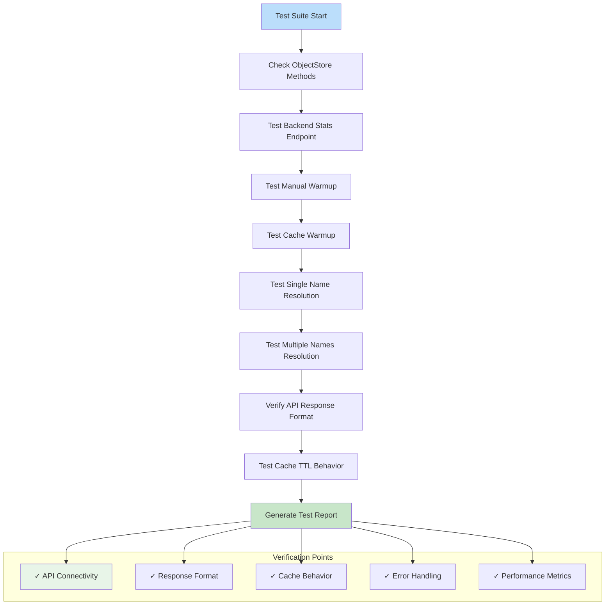
```mermaid
flowchart TD
    A[Test Suite Start] --> B[Check ObjectStore Methods]
    B --> C[Test Backend Stats Endpoint]
    C --> D[Test Manual Warmup]
    D --> E[Test Cache Warmup]
    E --> F[Test Single Name Resolution]
    F --> G[Test Multiple Names Resolution]
    G --> H[Verify API Response Format]
    H --> I[Test Cache TTL Behavior]
    I --> J[Generate Test Report]
    
    subgraph "Verification Points"
        K[✓ API Connectivity]
        L[✓ Response Format]
        M[✓ Cache Behavior]
        N[✓ Error Handling]
        O[✓ Performance Metrics]
    end
    
    J --> K
    J --> L
    J --> M
    J --> N
    J --> O
    
    style A fill:#bbdefb
    style J fill:#c8e6c9
    style K fill:#e8f5e8
```

### Test Execution Flow

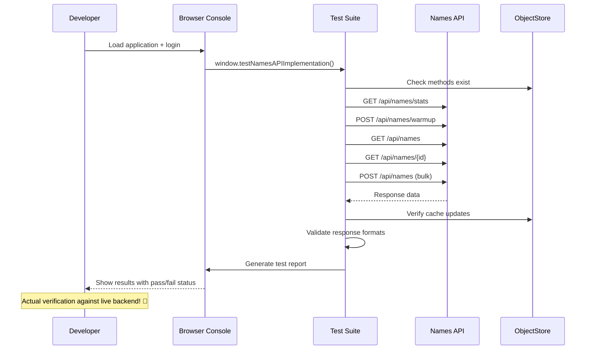
```mermaid
sequenceDiagram
    participant Dev as Developer
    participant Browser as Browser Console
    participant Test as Test Suite
    participant API as Names API
    participant Store as ObjectStore
    
    Dev->>Browser: Load application + login
    Browser->>Test: window.testNamesAPIImplementation()
    
    Test->>Store: Check methods exist
    Test->>API: GET /api/names/stats
    Test->>API: POST /api/names/warmup  
    Test->>API: GET /api/names
    Test->>API: GET /api/names/{id}
    Test->>API: POST /api/names (bulk)
    
    API-->>Test: Response data
    Test->>Store: Verify cache updates
    Test->>Test: Validate response formats
    Test->>Browser: Generate test report
    
    Browser-->>Dev: Show results with pass/fail status
    
    Note over Dev: Actual verification against live backend! 🎯
```

## Troubleshooting Guide

### Common Issues and Solutions

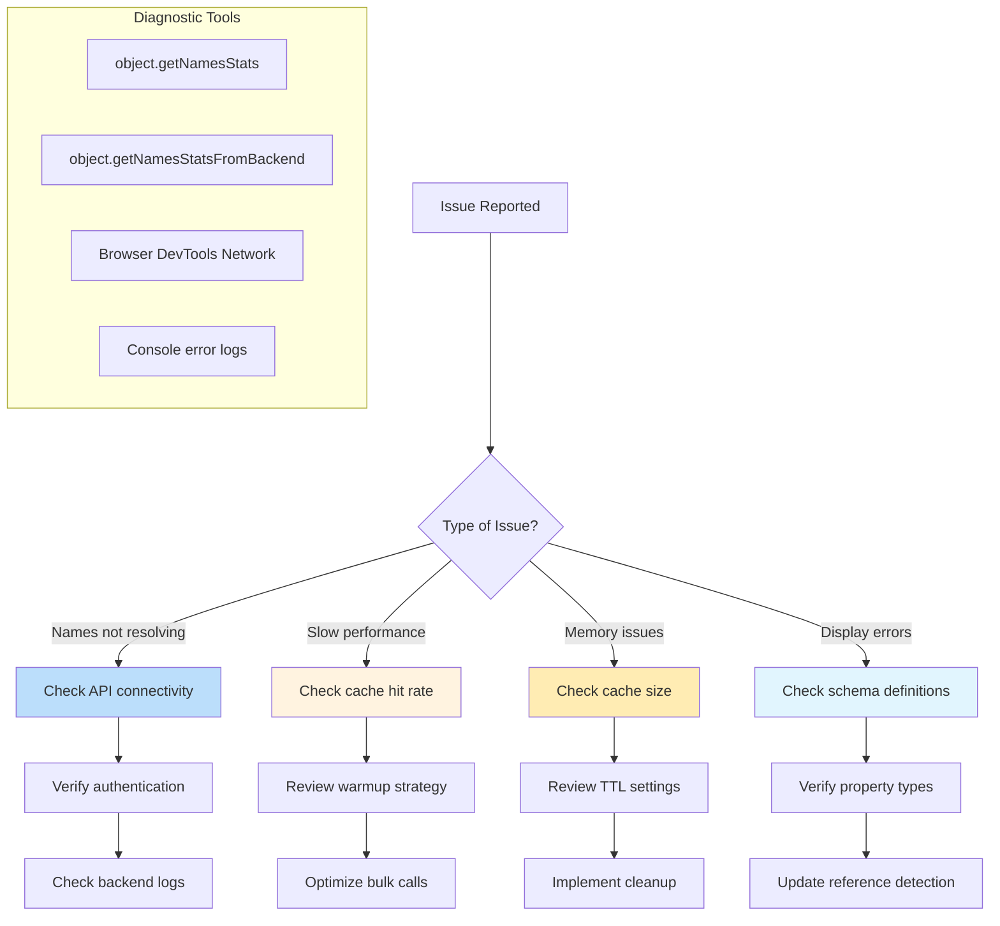
```mermaid
flowchart TD
    A[Issue Reported] --> B{Type of Issue?}
    
    B -->|Names not resolving| C[Check API connectivity]
    C --> D[Verify authentication]
    D --> E[Check backend logs]
    
    B -->|Slow performance| F[Check cache hit rate]
    F --> G[Review warmup strategy]
    G --> H[Optimize bulk calls]
    
    B -->|Memory issues| I[Check cache size]
    I --> J[Review TTL settings]
    J --> K[Implement cleanup]
    
    B -->|Display errors| L[Check schema definitions]
    L --> M[Verify property types]
    M --> N[Update reference detection]
    
    subgraph "Diagnostic Tools"
        O[object.getNamesStats]
        P[object.getNamesStatsFromBackend]
        Q[Browser DevTools Network]
        R[Console error logs]
    end
    
    style C fill:#bbdefb
    style F fill:#fff3e0
    style I fill:#ffecb3
    style L fill:#e1f5fe
```

## Future Enhancements

Roadmap voor verdere optimalisaties:

```mermaid
timeline
    title Names Cache System Roadmap
    
    section Phase 1 ✅
        Core Implementation    : ObjectStore integration
                              : Reference detection
                              : Table integration
                              : Search page names
                              : Publication cards
    
    section Phase 2 🔄
        Filter improvements    : Advanced facets
                              : Smart suggestions
    
    section Phase 3 📋
        Advanced Features      : Real-time updates
                              : WebSocket integration
                              : Smart prefetching
    
    section Phase 4 🚀
        Performance           : Service Worker caching
                             : IndexedDB persistence
                             : Background sync
```

Dit Names Cache System zorgt voor een **dramatische verbetering** van de gebruikerservaring door UUIDs automatisch om te zetten naar leesbare namen, terwijl het optimale performance behoudt door intelligent caching.
