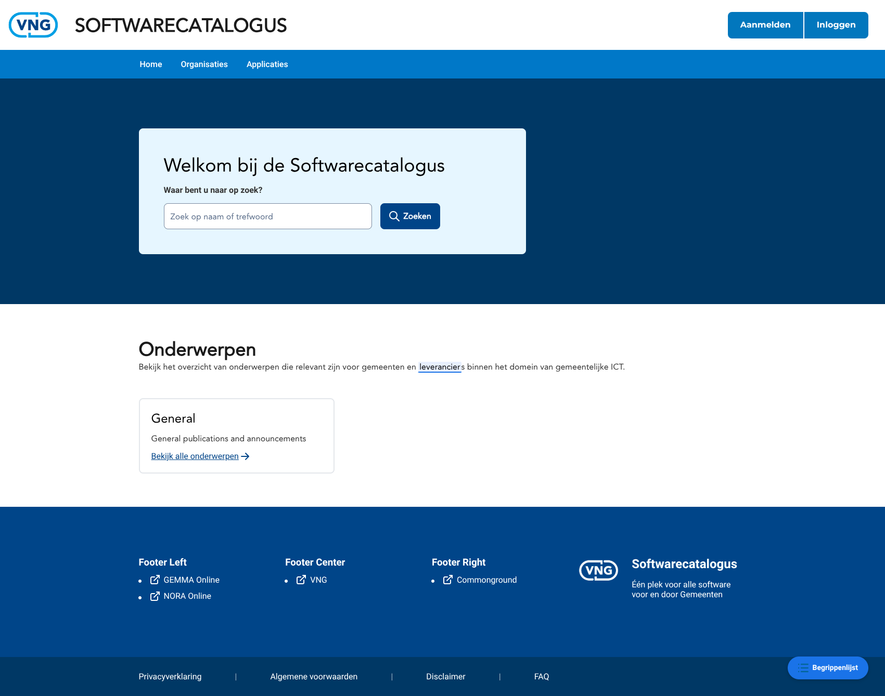
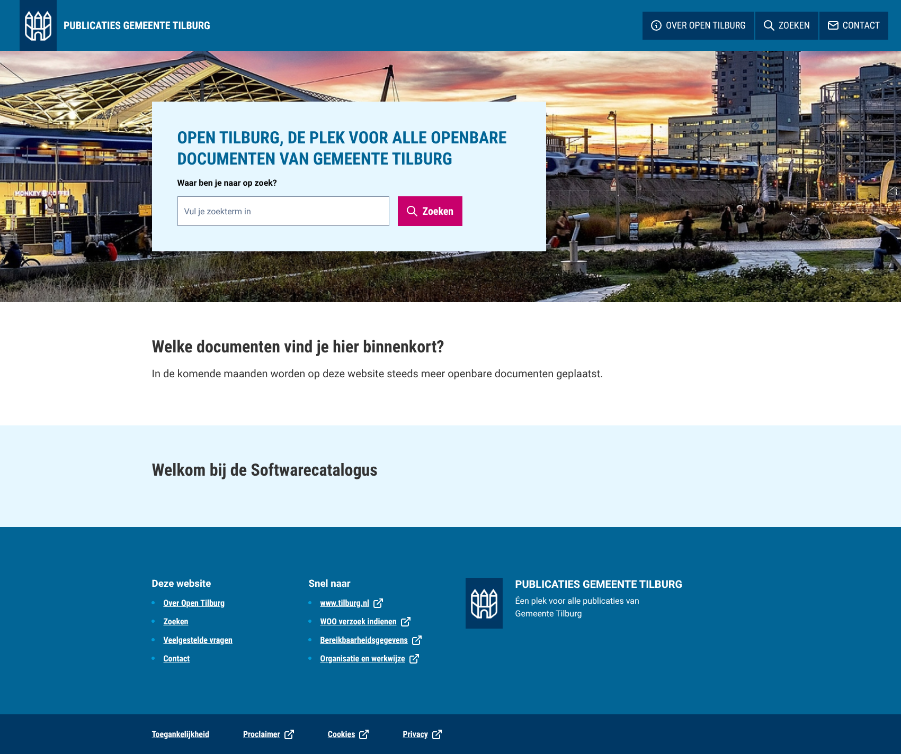
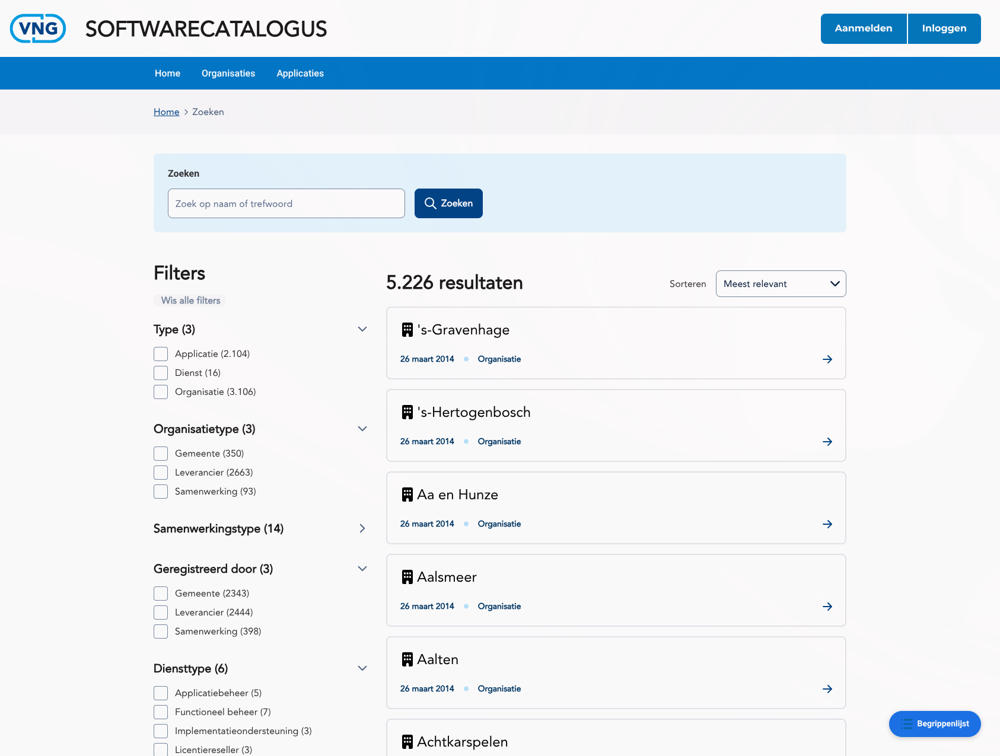
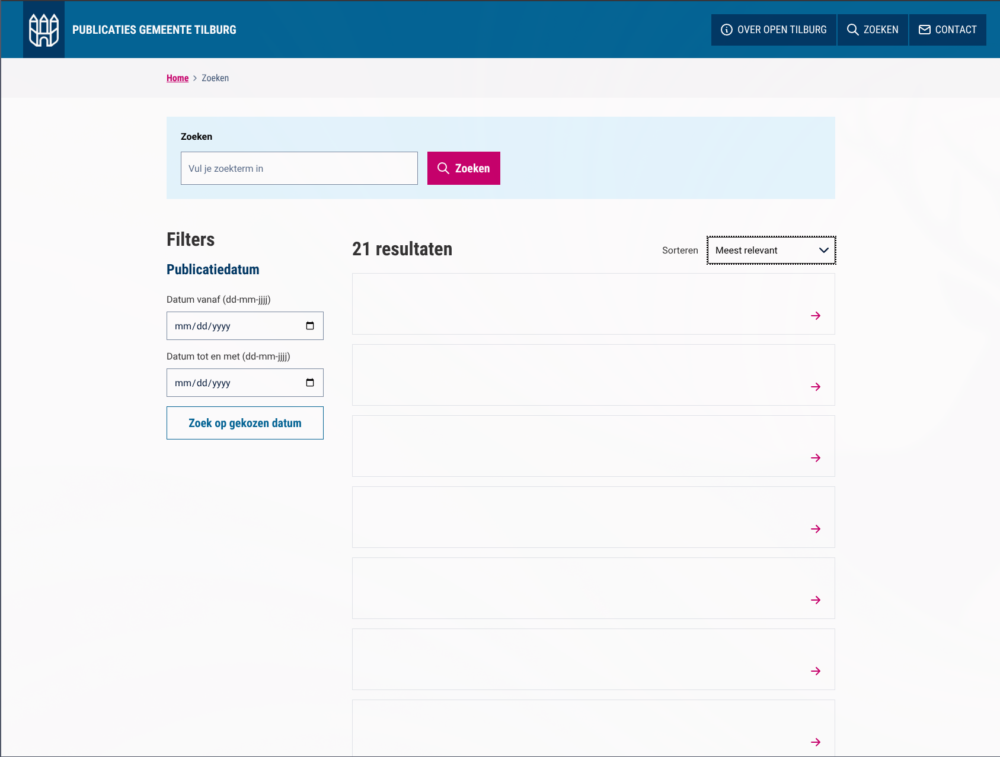
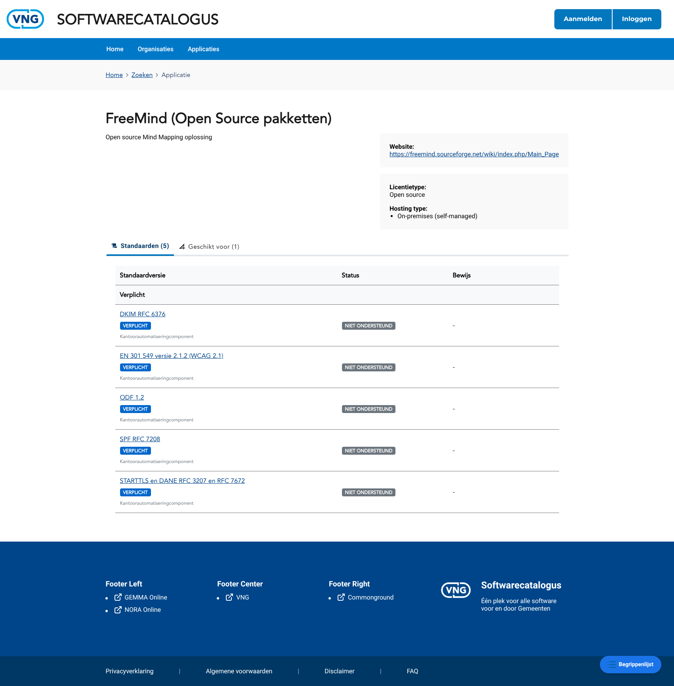
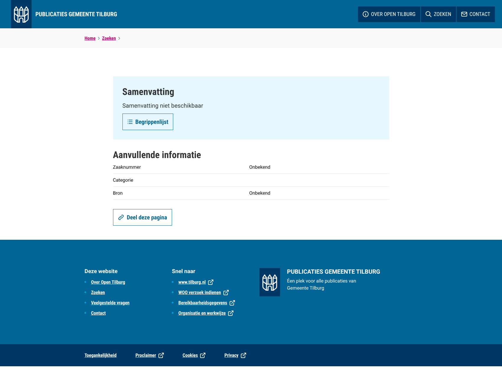

# PO Vergelijking — Ons vs Acato

> **TL;DR — niet rebasen op Acato's laatste versie.** Wij hebben in de praktijk alles wat zij hebben (en meer), terwijl hun app niet volledig werkt. Een rebase levert geen winst op en kost werkende functionaliteit.

**Voor:** Product Owner — Conduction (tilburg-woo-ui).
**Vergelijkt:** onze versie van de Tilburg WOO-portaal tegen Acato's originele versie.
**Scope:** wat een gebruiker *ziet, doet en ervaart* — zowel visueel (layout, teksten, plek van knoppen) als functioneel (wat werkt, wat niet, wat ontbreekt, wat extra is). Vanuit het perspectief van de eindgebruiker, niet-technisch.
**Buiten scope:** interne refactors, dataflow, store-architectuur, codestijl, API-shapes.

---

## Inhoudsopgave

1. [Homepage](#1-homepage)
2. [Zoekpagina (filters, sortering, paginering)](#2-zoekpagina)
3. [Publicatiepagina](#3-publicatiepagina)
4. [Beheeromgeving (alleen wij)](#4-beheeromgeving-alleen-wij)
5. [Onderwerpen-, over-ons- en andere contentpagina's](#5-onderwerpen--over-ons--en-andere-contentpaginas)

---

## 1. Homepage

**Waar:** `/` (de landingspagina).

### Screenshots (2026-05-22)

- Ons: 
- Acato: 

### PO walkthrough-aantekeningen (2026-05-22)

- **"Begrippenlijst"-knop**, rechtsonder in het scherm. Wij hebben deze knop; Acato niet. De knop werkt momenteel niet — klikken doet niets.
    - **Besluit (PO + tech lead):** behouden, maar de knop moet wel gefixt worden zodat hij de drawer ook echt opent.
- **Secundaire navigatiebalk** onder de header (Home / Organisaties / Applicaties), zichtbaar op de homepage. Wij hebben deze balk; Acato niet.
    - **Besluit (PO + tech lead):** behouden — geen wijziging.
- **"General"-kaart op de homepage.** Visueel **identiek** bij ons en bij Acato: hetzelfde kaart-component (icoon links, titel, korte tekst, link met pijltje onderaan), in een grid van drie kolommen. Het blok komt bij ons en bij Acato echter uit **verschillende databronnen met een ander doel**:
    - **Ons blok = "Onderwerpen" (themadossiers).** Dynamisch gevuld vanuit de themes-bron in OpenCatalogi. Elke kaart linkt naar de URL die de backend voor dat thema meegeeft — die kan naar een eigen pagina wijzen, naar een externe website, of naar iets anders. Geeft de backend géén URL mee, dan bouwt onze code automatisch een gefilterde zoekopdracht op het thema-id (`/zoeken?themes=<id>`) als terugval. Dat we nu maar één kaart ("General") zien, is omdat de bron op dit moment maar één thema teruggeeft — niet omdat de kaart als unieke ingang is bedoeld. Er hoort een rij thema-kaarten te staan.
    - **Acato's blok = "Welke documenten vind je hier binnenkort?" (documentsoorten).** Gevuld vanuit een aparte categories-bron. Elke kaart vertegenwoordigt een type WOO-document (raadsstuk, bestuursstuk, convenant, organisatie, woo-verzoek, etc.) en linkt naar wat de backend meegeeft — op hun live site zijn dat (deels) doorlinks naar volledig andere websites. Geen terugval-zoekopdracht; ontbreekt de URL, dan is de link leeg.
    - **Bewuste keuze van Acato, niet per ongeluk.** In Acato's broncode staat het oude themes-blok nog gewoon — maar uitgecommentarieerd. Ze hebben actief besloten om het themadossiers-concept te vervangen door dit documentsoorten-blok, niet om themes simpelweg "weg te laten". Voor de keuze hieronder relevant: optie 2 betekent Acato's afslag volgen; optie 1 betekent vasthouden aan het concept dat zij hebben verlaten.
    - **Keuze:** drie richtingen mogelijk:
        1. **Ons concept houden** — themadossiers — en zorgen dat de themes-bron meer thema's teruggeeft.
        2. **Naar Acato's concept overstappen** — kaarten als overzicht van documentsoorten met handmatig ingestelde links.
        3. **Beide concepten samenvoegen** — twee sectie-blokken naast elkaar op de homepage (eerst onderwerpen, dan documentsoorten of andersom).
- **"Uitgelicht"-sectie (3 nieuwste/uitgelichte publicaties).** Acato toont onder de hero een blok met drie publicatiekaarten — uitgelichte publicaties (handmatig gevlagd in de backend), aangevuld met de meest recente als er geen of niet genoeg gevlagde zijn. Wij tonen dit blok **niet**. Belangrijk om te weten: dit is iets dat **Acato ná de fork heeft afgemaakt**. Bij ons bestaat alleen het lege omhulsel dat al vóór de splitsing in de codebase stond; zij hebben het na de splitsing alsnog werkend gemaakt. We zijn dus geen feature kwijtgeraakt — zij hebben er één bijgebouwd.
    - Hoe het bij Acato wordt gevuld: een redacteur zet in de backend een `featured`-vinkje op een publicatie. Die publicaties verschijnen automatisch in dit blok (max. 3, nieuwste eerst). Geen vinkjes? Dan vult Acato aan met de drie meest recente publicaties. Géén publicaties in de backend? Dan verdwijnt het blok zonder melding — er is geen lege-staat-tegel.
    - Bij ons: het blok bestaat alleen als technische ruïne — er is een leeg `AcFeatured`-component in onze code dat nergens wordt aangeroepen en geen data ontvangt. Er is ook geen data-ophaalmechanisme voor "uitgelichte publicaties" in onze store; we hebben dus niets om dit blok mee te vullen, ook niet als we het zouden inschakelen.
    - **Keuze:** de Uitgelicht-sectie alsnog activeren (vereist een redactionele beslissing over welke publicaties als "uitgelicht" gelden + technisch werk), of het blok niet tonen?
- **"Welkom / Over"-sectie onderaan de homepage.** Onder de andere blokken staat een sectie met een titel (per tenant verschillend, geheel uit het CMS), een paragraaf tekst, een link, en een afbeelding ernaast. Visueel grotendeels gelijk, maar:
    - **Acato heeft een extra alinea voor een lijst/opsomming** tussen de hoofdtekst en de link. Dat is een tweede tekstveld dat de redacteur kan invullen — bijvoorbeeld een bullet-achtige opsomming van punten waar de website over gaat. Wij hebben dit veld helemaal niet; redacteuren kunnen bij ons dus alleen de hoofdparagraaf vullen.
    - **Acato zet deze sectie op een blauwe achtergrond** voor visuele scheiding van de rest van de pagina. Bij ons staat het op de standaard (witte) achtergrond.
    - **Wij verbergen de sectie automatisch** als de redacteur titel of hoofdtekst leeg laat (graceful fallback). Acato rendert 'm altijd, ook al staat-ie helemaal leeg.
    - **Keuze:** willen we het lijst-veld erbij (extra tekstveld voor de redacteur, vereist CMS-aanpassing), de blauwe achtergrond overnemen, en/of het altijd-renderen-pad volgen?

---

## 2. Zoekpagina

**Waar:** `/zoeken` (ook bereikbaar via de homepage-hero, de zoeklink in de header en de footer).

### Screenshots (2026-05-22)

- Ons: 
- Acato (Open Tilburg): 

### PO walkthrough-aantekeningen (2026-05-22)

- **Resultaatkaarten.** Acato gebruikt één generieke kaart die niet werkt met onze datastructuur. Wij gebruiken specifieke kaarten per documenttype.
    - **Keuze:** onze documenttype-specifieke kaarten behouden, of overstappen op één generieke kaart zoals Acato (eenvoudiger, maar verliest contextuele informatie per type)?
- **Filters.** Acato filtert alleen op datum (`date-from` / `date-to`). Wij filteren op meerdere facetten (Type, Organisatietype, Geregistreerd door, Diensttype, etc.), maar hebben geen datumfilter.
    - **Keuze:** ons facet-filtersysteem houden zoals het is, vereenvoudigen naar Acato's datum-only aanpak, of de twee combineren door een datumfilter toe te voegen aan ons facetsysteem?

---

## 3. Publicatiepagina

**Waar:** de pagina waar je op landt na het klikken op een zoekresultaat.

### Screenshots (2026-05-22)

- Ons: 
- Acato: 

### PO walkthrough-aantekeningen (2026-05-22)

- **Generieke vs. specifieke pagina.** Acato's pagina is generiek; de onze is specifiek per documenttype.
    - **Keuze:** de documenttype-specifieke layouts behouden (elke type krijgt een eigen presentatie), of overstappen op één generieke layout zoals Acato (alle pagina's zien er hetzelfde uit, ongeacht het documenttype)?
- **"Begrippenlijst"-knop in de samenvatting.** Acato heeft die knop toegevoegd aan de samenvattingskaart, net zoals wij hem hebben rechtsonder in het scherm (zie aantekening in §1 Homepage).
    - **Keuze:** de "Begrippenlijst"-knop op zijn huidige plek (rechtsonder) houden, verplaatsen naar de samenvattingskaart zoals Acato, of beide plekken behouden?
